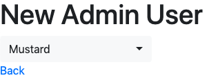

# What's this
This is an application for verifying [the solution for bootstrap-select-rails
 to work with Turbolinks 5](https://github.com/Slashek/bootstrap-select-rails/issues/31).


# To run this application

```sh
docker build -t temp .
docker run --rm -it -v (pwd):/usr/src/myapp -p 80:3000 temp rails s -b 0.0.0.0
```

1. open http://localhost/admin_users
2. click `New Admin User`



bootstrap-select-rails works well!:tada:
